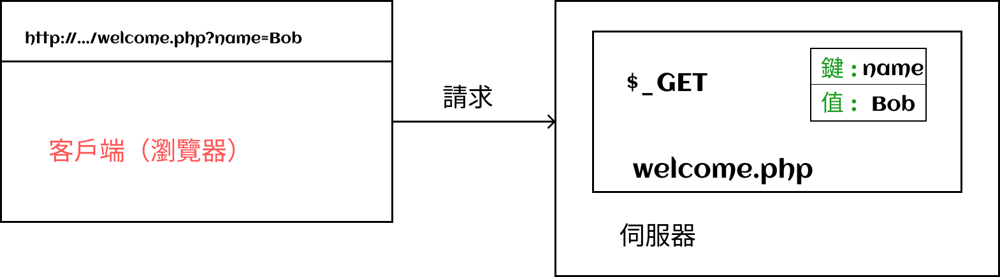

# 超全域變數

PHP 允許我們建立**動態**網站，例如，如果我們想訪問產品頁面，我們可以更改 URL 以顯示所需的產品。

因此，根據請求的上下文，顯示的頁面將包含不同的資訊。 這就是所謂的**動態**。

超全域變數是由 PHP 自身管理的變量。 它們以`$_NOM`的形式書寫。

超全域變數是數組。 每個超全域變數在 PHP 處理請求方面都有特定的作用。

因此，根據需要，可以找到超全域變量，如`$_SERVER`、`$_COOKIE`、`$_REQUEST`等。`

超全域變數在 PHP 腳本中從其執行開始就可用。

:::danger 警告

超全域變量是**只讀**變量。 這意味著我們可以根據需要從這些變量中**讀取**信息（查詢字串、表單資料、請求資訊等等），但**絕不能**透過在這些變量中寫入信息來進行雙向通訊。

> 唯一的例外是 `$_SESSION` 變量，我們稍後會討論。 所以目前要記住超全域變數是只讀的。

:::

## $\_GET

`$_GET ` 陣列將包含 **URL 參數**（英文中稱為 `query string` 查詢字串）。

如果從如下 `URL：http://mydomain.com/product.php`，我可以在這個 URL 後面加入參數。

為此，在 URL 後面我會加上一個問號 `?`，然後是第一個參數的名稱，等號 `=`，以及參數的值：
`http://mydomain.com/product.php?myParameter=myValue`。

從 PHP 的角度來看，當它接收到具有此類 URL 的請求時，它將透過將 URL 參數**對應（映射）**到 `$_GET` 陣列來處理這些參數。

> 這是 `$_GET` 數組的作用，這在 PHP 的運作中是有預設的。 我們將逐漸了解各個超全局數組的作用。

如果我想在我的 URL 中傳遞多個參數，我可以使用 `&` 字符將它們分開：
`http://mydomain.com/product.php?myParameter=myValue&anotherParameter=anotherValue`。

因此，需要記住以下內容：

-   `$_GET` 陣列包含 URL 參數
-   在 URL 中，每個參數都以以下方式呈現：`nom=valeur`
-   要在 URL 中新增第一個參數，必須在參數名稱之前使用 `?` 字符
-   為了分隔不同的 URL 參數，我們將使用 `&` 字符

在 `$_GET` 陣列中，參數以關聯數組的形式表示：索引=參數名稱，值=參數值

## $\_POST

`$_POST`數組包含在 HTTP 請求的正文中傳遞的變數。

> 這個陣列最常見的用法是與表單一起使用。

:::info 提醒
要記住，`$_POST` 數組和 `$_GET` 數組都是根據相同的 HTTP 方法命名的。

預設（默認）情況下，當顯示一個網頁時，使用的是 `GET` 方法。

但是，例如在表單中，我們也可以使用 `POST` 方法。
:::

工作原理與 GET 方法相同：在請求正文中傳遞的變量將以名稱/值 => 鍵/值的形式對應到陣列中。
