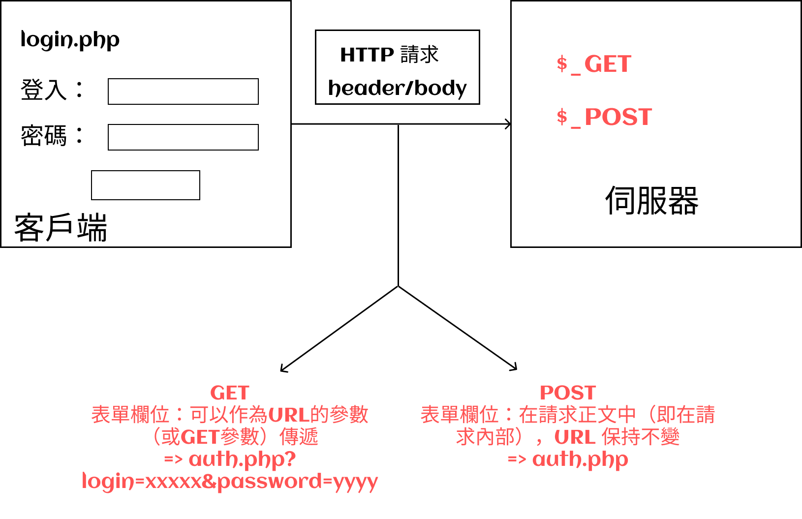

# 表單

PHP 中的表單將允許我們根據使用者輸入的值觸發處理過程。

為此，我們將在 `$_GET` 或 `$_POST` 數組中接收這些值。

## HTTP 方法

:::note HTTP 方法或 HTTP 動詞

在使用 HTTP 發出請求時，我們可以指定一個方法或 HTTP 動詞來執行該請求。
因此，選擇一種方法具有特定含義，這也解釋了為什麼要使用「動詞」這個詞（HTTP 動詞）。

:::

在表單中，我們可以選擇 `GET` 方法或 `POST` 方法。 選擇方法將更改瀏覽器將請求發送到伺服器的方式，也將更改伺服器接收資料（數據）的方式。

要確定使用哪種 HTTP 的方法，我們將使用 `form` 標籤的 `method` 屬性。

```json
<form method="POST">...</form>
```

### GET

如果我們選擇使用 `GET` 方法來處理我們的表單，那麼表單欄位將以 URL 參數的形式自動**對應到 URL 中**。

> 例如：搜尋表單

### POST

如果我們使用`POST`方法來處理表單，那麼表單欄位（字段）將會**對應（映射）到請求的主體**。

> 例如：登入表單（我們不希望登入名稱和密碼以明文形式出現在 URL 中）

## 目標

我們也可以指定表單的目標，即將接收和處理輸入資訊的頁面。 我們使用`action`屬性來實現這一點：

```json
<form action="traitement.php" method="POST">...</form>
```

在表單驗證後，伺服器將在目標頁面接收資料。

如果使用`GET`方法，那麼輸入的值將會作為 URL 的參數傳遞。`

:::note
這在某些情況下非常有用，例如在搜尋引擎中，如果我們想與他人分享 URL。 這個 URL 包含了我們在表單中輸入的所有參數，因此我們可以直接使用 URL 來"重現"相同的搜尋。
:::

如果使用`POST`方法，那麼變量將被傳遞到請求的正文中。`

:::note
POST 方法必須在登入表單等敏感資訊（信息）的情況下使用。 輸入的資料不會暴露在 URL 中，而是被包含在請求的正文中。 如果使用 HTTPS，請求正文將被加密，其中包含的資料也將受到保護。
:::

在目標檔案中，您可以根據在表單中選擇的方法，在`$_POST`或`$_GET`陣列中檢索表單的值。

```json
<form action="traitement.php" method="POST">...</form>
```



:::caution 重要提示
如果未提供 `action` 屬性，則表單的預設目標將是目前腳本。 如果未提供 `method` 屬性，則預設方法將是 `GET`。
:::

## 表單字段

在 HTML 表單中，我們使用 `form` 標籤將所有欄位包含起來。

為了能夠在處理表單的目標頁面中找到所有字段，每個字段都**必須**具有`name`屬性。

```json
<form action="traitement.php" method="POST">
  <input type="text" name="prenom" />
</form>
```

在`traitement.php`中，可以透過以下方式取得輸入的名字：

```json
$prenom = $_POST['prenom'];
```

:::danger 注意
如果您忘記在欄位上新增 name 屬性，那麼該欄位將不會包含在由瀏覽器傳送的資料中，因此不會被 PHP 取得，我們將無法讀取輸入的值！ 因此，請確保為每個需要處理的欄位都新增 name 屬性。
:::
