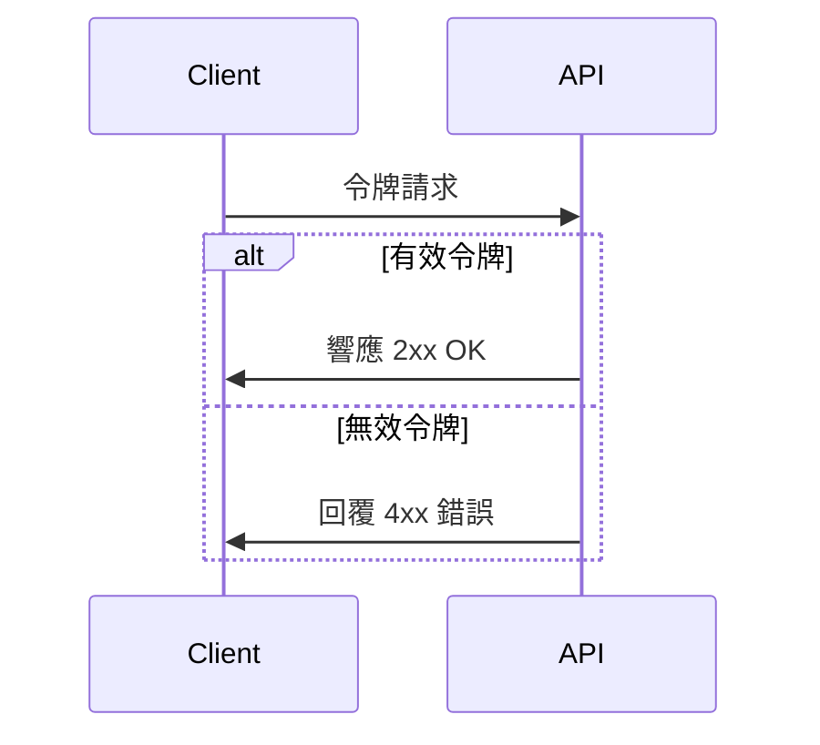

# 應用程式介面令牌

使用 API 令牌進行身份驗證需要先在服務中註冊，以便取得令牌。

這種存取 API 的方法通常用於我們的應用程式所依賴的提供功能的服務。 相關服務還可以記錄請求數量，並在必要時根據訂閱等級等情況進行限制。 這是一種常用的商業模式。

## 例如

-   [Graphhopper](https://www.graphhopper.com/)：地理編碼、路線計算
-   [Fixer](https://fixer.io/)： 匯率
-   [OpenWeather API](https://openweathermap.org/api)：天氣
-   [The Movie Database](https://developer.themoviedb.org/docs) : 電影

## 使用

註冊完成後，我們會收到與我們的帳戶關聯的 API 令牌。

這個令牌將在我們對 API 的請求中使用。

令牌的格式可能會有所不同。

## 查詢字串

可以將令牌附加到我們呼叫的 URL 中，例如：

```json
http://api.service.com/api/search?apikey=OklDeJjErBKNMCRaiLDPuIB3Ca
```

## 請求頭

如果我們知道 API 期望有一個驗證標頭才能執行操作，我們也可以將令牌作為專用標頭新增至請求中。

```json
GET http://api.service.com/api/search HTTP/1.1
Api-Key: OklDeJjErBKNMCRaiLDPuIB3Ca
```


