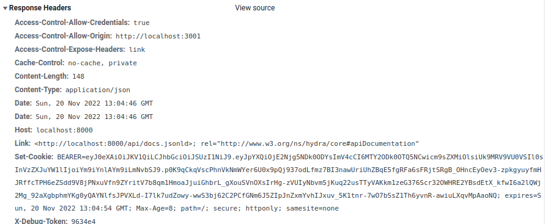

# JWT

## 介紹

傳統上，在客戶端/伺服器架構中，我們可以在伺服器端保留有關客戶端的資料。 以 PHP 中的會話為例，客戶端會收到一個 cookie 形式的會話識別碼。 隨後，客戶端在每個請求中發送此 cookie，伺服器能夠還原客戶端的會話。 因此，我們可以實作一個保持頁面之間導航上下文的身份驗證系統。

這種導航在每個請求之間保持狀態，稱為**有狀態**導航。

## JWT

對於後端 API，我們可能希望從多個客戶端使用該 API。 例如，我可以為同一用戶設定一個 ReactJS 應用程式、一個行動應用程式和一個嵌入式應用程式。

此外，將會話儲存在伺服器端可能會佔用大量磁碟空間。

因此，我們將使用**無狀態**的**JWT（JSON Web Token）**身份驗證。

:::info JWT
[JWT](https://jwt.io/) 是一個編碼字串，包含各種資訊：

-   產生日期（時間戳）
-   使用的演算法
-   包含使用者資訊的有效載荷
-   伺服器端產生的驗證簽名
    JWT 也稱為承載令牌(`Bearer Token`)。

:::

我們將在伺服器端**產生並簽署**JWT，然後將其發送回客戶端。

### 原理

工作原理如下：

-   在前端進行身份驗證，然後取得包含 JWT 的後端回應。
-   找到一種方式將 JWT 儲存在前端。
-   對於發送到後端的每個請求，在授權(`Authorization`)頭中附加 JWT。
-   因此，伺服器負責驗證 JWT
-   伺服器不會儲存 JWT，它只是在連接時發送它，然後在後續請求中進行檢查。

## 儲存 JWT

### 本地儲存

收到伺服器的回應後，可以直接從回應正文中取得 JWT，然後將其儲存到本機儲存空間（`localStorage`）：

```json
try {
  const response = await login({
    username: usernameRef.current.value,
    password: passwordRef.current.value,
  });
  localStorage.setItem("token", response.data.token);
  dispatch({ type: "login" }); // Dispatch login to context
  navigate("/admin/users");
} catch (e) {
  console.error(e);
}

```

這裡，如果我們遇到錯誤，我們會將其記錄在控制台，但我們也可以使用錯誤訊息或[toast 通知](https://www.npmjs.com/package/toastr) 的系統。

將 JWT 儲存在本地儲存中可以使我們在需要刷新頁面時**檢索令牌**，以恢復連接上下文。

```json
src/App.js
<!--truncate-->
import axios from 'axios';

function App() {
  const { dispatch } = useContext(UserContext);

  useEffect(() => {
    axios
      // 在伺服器端，你可以設定一個端點，除了在身份驗證成功的情況下讓請求通過外，什麼也不做
      .get(`${process.env.REACT_APP_API_ENTRYPOINT}/check/auth`, {
        headers: {
          Authorization: `Bearer ${localStorage.getItem('token')}`,
        }
      })
      .then(() => dispatch({ type: "login" }));
  }, []);

  return (
    //...
  );
}
```

### Cookie

在伺服器端，也可以使用 `Set-Cookie` 回應頭將 JWT 直接保存在 HTTP 純 Cookie 中。

這樣，就不再需要操作 `localStorage`，JWT 將附加到對 API 的每個請求中。

此外，將 JWT 放在 **HTTP-only** cookie 中會稍微安全一些，因為在這種情況下，就不能再使用 JavaScript 存取 JWT 了。



:::note 配置
如果使用 cookie 儲存 JWT，則必須將 `withCredentials` 選項設為 `true`，以便瀏覽器接收 `Set-Cookie` 指令並正確註冊 cookie：

```json
const result = await axios.post(
  `${process.env.REACT_APP_API_ENTRYPOINT}/login_check`,
  data,
  {
    withCredentials: true,
  }
);


```

在伺服器端，您需要在回應中將 `Access-Control-Allow-Credentials` 頭資訊設為 `true`
:::

## 刷新令牌

在前後端分離的應用程式中，使用 JWT 進行身份驗證非常普遍。

JWT 的主要風險在於它可能被竊取。 例如，如果 JWT 位於本機儲存區(`localStorage`)，任意 JS 程式碼執行後，就可以存取本機儲存區並取得令牌的值。

因此，可以使用此令牌代表應用程式使用者偽造自己的請求。

在伺服器端，當我們設定 JWT 時，會配置一個**有效期**。

JWT 是**無狀態**的，因此除了等待被盜令牌過期或使伺服器端的所有 JWT 失效外，我們沒有太多選擇來限制風險。

刷新令牌的原則是使用第二個令牌（刷新令牌）來刷新第一個令牌（JWT）。

這很容易讓人產生疑問，因為在這種情況下，我們可以嘗試竊取刷新令牌並執行與 JWT 類似的攻擊。

主要區別在於，刷新令牌與 JWT 不同，它**儲存在伺服器端**。

通常情況下，它會儲存在資料庫中。

因此，原理很簡單：為 JWT 定義一個很短的有效期，這樣就能減少任何攻擊的持續時間，如果刷新令牌被盜，可以透過命令列等方式單獨使其失效。

因此，您需要在應用程式中管理 JWT 的較短有效期，並確保以透明方式刷新令牌。

為此，我們可以使用 Axios **攔截器**，例如：如果我們的應用程式介面出現錯誤（通常是回應代碼 **`401 未授權(Unauthorized)`**），我們將攔截回應，使用刷新令牌刷新 JWT，然後重新啟動請求。 對於用戶來說，這一切都是完全透明的，因為它是在後台運行的。
